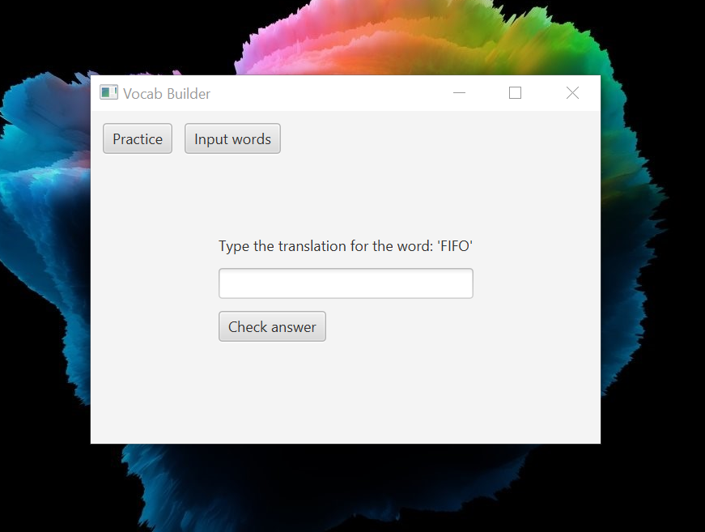

# Vocab Builder

A basic app that lets you grow your vocabulary.

This app consists of two views -
  * Practice View
  * Input View

Input view will allow you to add your own words. 
Practice view will allow you to begin practicing and have fun.
(You can use it to learn acronyms, words, letters and so much more)
